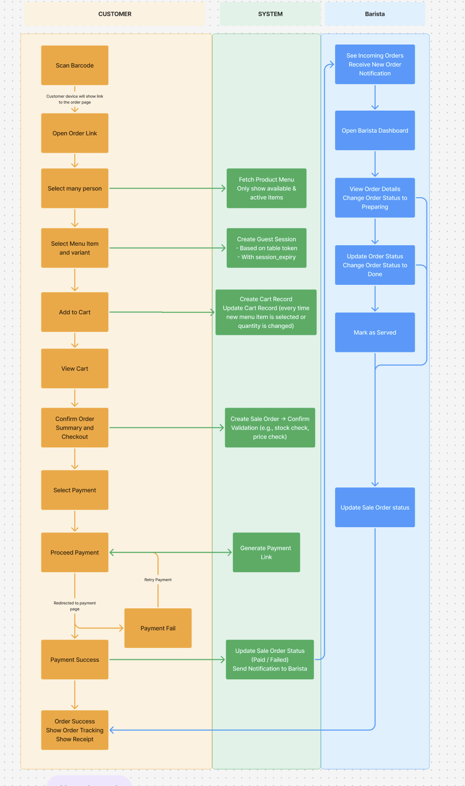

# Coffee Ordering System for Odoo ☕️


An Odoo custom module that enables customers to order coffee by scanning a QR code at their table. Ideal for cafes and coffee shops looking to streamline ordering and reduce manual input.

---

## 🔧 Features

- QR code per table, generated dynamically
- Guest ordering session with 24-hour expiry
- Product menu displayed via website page (mobile-friendly)
- Order summary with line items
- Barista dashboard to manage orders (draft → confirmed → preparing → done)
- Optional QRIS payment integration (e.g., Xendit, Midtrans)
- Printable thermal-style PDF receipt

---

## 📦 Module Structure
```text
erpquick_coffee_ordering/
├── controllers/
│ └── main.py (website QR route)
├── models/
│ ├── coffee_order.py
├── views/
│ ├── coffee_order_views.xml
│ ├── coffee_menu_templates.xml
├── security/
│ ├── ir.model.access.csv
│ └── security.xml
├── manifest.py
├── init.py
```
---

## 📈 System Flow




## 🚀 Installation

1. Place the module in your Odoo `addons` directory
2. Activate Developer Mode
3. Install the module `Coffee Ordering System`
4. Ensure dependencies are installed:  
   `website`, `product`, `mail`, `sale_management`

---

## 🛠️ Configuration

- Navigate to **Coffee Tables** menu to create tables with QR codes
- Add products under the **Sales** → **Products**
- Scan a table’s QR code using a mobile device to place orders

---

## 📸 Screenshots (Coming Soon)
- [ ] QR Table view
- [ ] Customer ordering page
- [ ] Barista dashboard
- [ ] Receipt PDF

---

## ✍️ Author

**ERPQuick by Yudha Pixel**  
🔗 [github.com/yudha-pixel](https://github.com/yudha-pixel)
